# Modul 1 - HTML dan CSS

### 🦴  HTML

#### 1. Heading & Paragraph

Heading adalah sebuah format text pada HTML yang dapat berfungsi sebagai **judul** atau **subjudul**. Heading terdiri dari 6 tipe dari `<h1>` hingga `<h6>` di mana `<h1>` merupakan heading paling besar dan `<h6>` adalah heading paling kecil. Besar kecilnya heading menentukan seberapa penting informasi dari text tersebut.
```html
<h1>Ini adalah Heading 1</h1> 
<h2>Ini adalah Heading 2</h2> 
<h3>Ini adalah Heading 3</h3> 
<h4>Ini adalah Heading 4</h4> 
<h5>Ini adalah Heading 5</h5> 
<h6>Ini adalah Heading 6</h6>
```
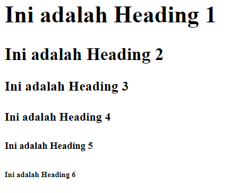

Paragraph adalah sebuah format text pada HTML yang dapat berfungsi sebagai **isi** atau **content**. Paragraph ditulis dengan menggunakan tag `<p>`.
```html
<p>Ini adalah paragraf pertama. Paragraf digunakan untuk menulis teks dalam bentuk blok yang rapi di HTML.</p> 
<p>Ini adalah paragraf kedua. Setiap paragraf baru dimulai dengan tag yang terpisah.</p>
```
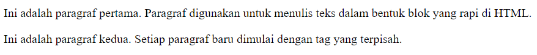

#### 2. Formatting

Text dalam HTML dapat diatur tampilannya dengan menggunakan beberapa tag formatting berikut:
- **Bold** `<b>` untuk **menebalkan** suatu text.
- **Italic** `<i>` untuk membuat suatu text menjadi **miring**.
- **Underline** `<u>` untuk memberikan **garis bawah** pada suatu text.
- **Strikethrough** `<s>` untuk memberikan **coretan** pada suatu text.
- **Superscript** `<sup>` untuk membuat suatu teks menjadi **di atas**. Biasanya digunakan untuk penulisan eksponen atau footnote.
- **Subscript** `<sub>` untuk membuat suatu teks menjadi **di bawah**. Biasanya digunakan untuk penulisan indeks atau formula kimia.
- **Mark** `<mark>` untuk memberikan **highlight** pada suatu text.
- **Small** `<small>` untuk **mengecilkan** suatu text.
```html
<p>Teks ini menggunakan <b>bold (tebal)</b>.</p>
<p>Teks ini menggunakan <i>italic (miring)</i>.</p>
<p>Teks ini menggunakan <u>underline (garis bawah)</u>.</p>
<p>Teks ini menggunakan <s>strikethrough (coretan)</s>.</p>
<p>Teks ini menggunakan <sup>superscript</sup>.</p>
<p>Teks ini menggunakan<sub>subscript</sub>.</p>
<p>Teks ini menggunakan <mark>highlight</mark>.</p>
<p>Teks ini menggunakan <small>small (teks kecil)</small>.</p>
```
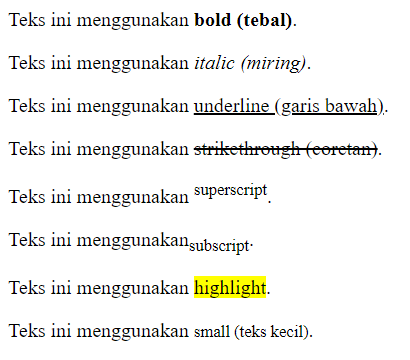

#### 3. Anchor

Anchor `<a>` adalah sebuah element HTML yang dapat digunakan untuk **memberikan tautan/link** menuju email, file, hingga halaman website lain. Element ini dapat membungkus element-element lain seperti heading, paragraph, image, dsb.
```html
<a href="https://www.w3schools.com/html/">Belajar HTML lewat sini</a>
```
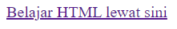

#### 4. Image

Jika ingin menambahkan gambar pada web HTML, dapat menggunakan element ``. Tag ini memiliki dua atribut penting yaitu `src` dan `alt`. Atribut `src` digunakan untuk **menentukan sumber lokasi atau URL dari gambar** yang ingin ditampilkan dan `alt` yang digunakan untuk **memberikan keterangan alternatif** jika gambar tidak dapat ditampilkan. Selain itu, terdapat atribut `height` dan `width` yang berfungsi untuk mengatur **panjang** dan **lebar** dari gambar yang ditampilkan.
```html


```
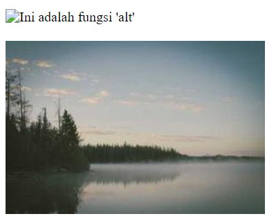

#### 5. Tabel

HTML memiliki element tersendiri untuk membuat tabel. Tag yang diperlukan untuk membuat tabel adalah sebagai berikut:

- **Table** `<table>` setiap membuat tabel baru harus dibungkus dengan tag `<table>`.
- **Table Row** `<tr>` setiap ingin membuat **row/baris** baru harus dibungkus dengan tag `<tr>`.
- **Table Header** `<th>` umumnya digunakan **header/judul** dari kolom tabel. Tag `<th>` akan membuat isi dari barisnya menjadi di **tengah (centered)** dan **tebal**.
- **Table Data** `<td>` umumnya digunakan untuk membuat **content/isi** dari tabel.
```html
<table>  
	<tr>  
		<th>Nama</th>  
		<th>Umur/th>  
		<th>Pekerjaan</th>  
	</tr>  
	<tr>  
		<td>Irfan</td>  
		<td>25</td>  
		<td>Tidak Bekerja</td>  
	</tr>  
	<tr>  
		<td>Hendro</td>  
		<td>26</td>  
		<td>Full Stack Developer</td>  
	</tr>  
</table>
```
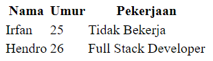

#### 6. List

HTML memiliki element tersendiri untuk membuat list. List dalam HTML terbagi menjadi 2 yaitu:

1. **Ordered List**
Ordered List memberikan list yang **memiliki urutan**. Umumnya digunakan untuk memberikan list yang perlu dirunut seperti langkah-langkah. Untuk membuat ordered list harus membungkus tag `<li>` di dalam `<ol>`.
```html
<ol>
	<li>Langkah pertama</li>
	<li>Langkah Kedua</li>
	<li>Langkah ketiga</li>
</ol>
```
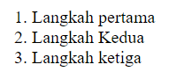

2. Unordered List
Unordered List memberikan list yang **tidak memiliki urutan**. Umumnya digunakan untuk memberikan list yang tidak perlu dirunut. Untuk membuat unordered list harus membungkus tag `<li>` di dalam `<ul>`.
```html
<ul>
	<li>Item 1</li>
	<li>Item 2</li>
	<li>Item 3</li>
</ul>
```
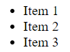

#### 7. Forms

Forms HTML adalah sebuah format untuk melakukan **user input**. Hasil user input tersebut umumnya digunakan untuk diproses ke server atau database. Pembuatan form HTML umumnya menggunakan pembungkus `<form>`. Di dalamnya akan terdapat beberapa element lain yang berfungsi sebagai user inputnya. Element-element tersebut adalah sebagai berikut:

- `<input>` adalah sebuah element untuk meminta input user. Jenis input yang dimasukkan dapat berupa apapun dengan menambahkan atribut `type` di dalamnya. Terdapat banyak sekali opsi `type` pada input, contoh: `radio`, `text`, `time`, `date`, `number`, `password`, dsb.
- `<label>` berfungsi untuk menambahkan `<label>` pada element forms lain. Untuk menghubungkan `<label>` dan element forms lain, harus dihubungkan dengan menggunakan `id` yang sama pada kedua element.
- `<select>` berfungsi untuk memberikan pilihan berupa dropdown. Untuk memberikan option/pilihan dropdown-nya, dapat menggunakan tag `<option>`.
- `<textarea>` adalah element untuk meminta input user berupa text multi-line.
- `<button>` berfungsi untuk menambahkan element berupa button/tombol. `<button>` memiliki beberapa `type` juga seperti `button`, `submit`, atau `reset`.
- `<fieldset>` digunakan untuk membungkus dan mengelompokkan suatu data form yang berelasi. Untuk memberikan keterangan pada `<fieldset>`, dapat menggunakan element `<legend>`.
```html
<form  action="/submit"  method="POST">
	<fieldset>
		<legend>Informasi Pribadi</legend>

		<label  for="name">Nama Lengkap:</label>
		<input  type="text"  id="name"  name="name"  placeholder="Masukkan nama lengkap"  required>

		<br>
		<label  for="email">Email:</label>
		<input  type="email"  id="email"  name="email"  placeholder="Masukkan email"  required>

		<br>
		<label  for="password">Password:</label>
		<input  type="password"  id="password"  name="password"  placeholder="Masukkan password"  required>

		<br>
	<button  type="submit">Kirim</button>
</fieldset>

</form>
```
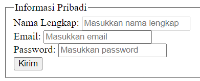

#### 8. Div

Div `<div>` adalah sebuah element **blok** yang umumnya digunakan sebagai sebuah **container** atau **memisahkan antar section** pada suatu halaman website. `<div>` digunakan untuk membungkus dan mengelompokkan beberapa element lain untuk menciptakan suatu section tersendiri.
```html
<div> 
	<h2>Judul Artikel pertama</h2> 
	<p>Ini adalah paragraf pertama dari artikel pertama.</p> 
</div>

<div> 
	<h2>Judul Artikel kedua</h2> 
	<p>Ini adalah paragraf pertama dari artikel kedua.</p> 
</div>
```
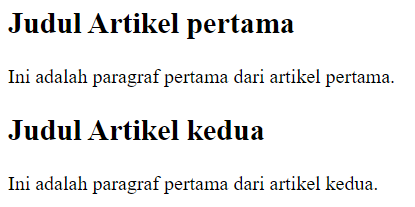

#### 9. Span

Span `<span>` adalah sebuah element **inline** yang umumnya digunakan untuk **membungkus bagian kecil** dari teks atau elemen lainnya agar bisa diberikan gaya atau manipulasi tertentu. Perbedannya dengan `<div>` adalah `<span>` tidak mengambil baris baru.
```html
<p>Teks ini memiliki <span style="color: red;">warna merah</span> hanya di bagian tertentu.</p>
```
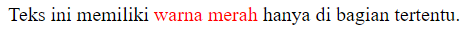

#### 10. Class

`class` adalah atribut yang digunakan untuk **menetapkan satu atau lebih kelas** pada element HTML. Elemen HTML bisa memiliki lebih dari satu `class`. Ini memungkinkan untuk melakukan pengelompokkan element-element yang berbeda di halaman menjadi satu atau lebih kelompok yang sama, sehingga element-element tersebut bisa memiliki gaya atau perilaku yang sama. `class` biasanya digunakan untuk menerapkan gaya yang sama atau manipulasi JavaScript pada beberapa element yang berbeda.
```html
<div class="box"></div>
<div class="box special"></div>
<p class="text">Ini adalah paragraf dengan kelas 'text'.</p>
```
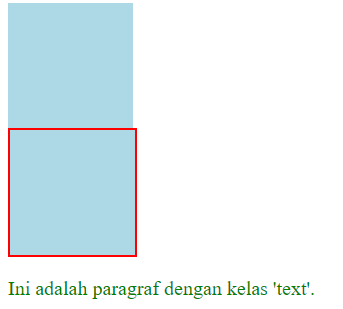

#### 11. Id 

`id` adalah atribut yang digunakan untuk memberikan **identitas unik** pada elemen HTML. Setiap elemen di halaman harus memiliki `id` yang unik, artinya tidak boleh ada `id` yang sama untuk beberapa elemen yang berbeda. Atribut `id` biasanya digunakan ketika ingin menargetkan satu elemen tertentu untuk diberikan gaya atau manipulasi JavaScript.
```html
<div id="header">Ini adalah header</div> 
<p id="intro">Ini adalah paragraf pertama yang memiliki id 'intro'.</p>
```
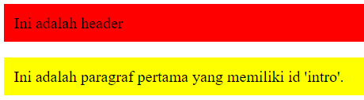

#### Perbedaan Class dan Id 
| Perbedaan      | `class`                                                                                                              | `id`                                                            |
| -------------- | -------------------------------------------------------------------------------------------------------------------- | --------------------------------------------------------------- |
| **Kegunaan**   | Digunakan untuk mengelompokkan beberapa elemen yang berbeda sehingga dapat diberikan gaya atau manipulasi yang sama. | Digunakan untuk memberikan identitas unik pada elemen tertentu. |
| **Penggunaan** | Dapat digunakan pada beberapa elemen yang berbeda.                                                                   | Hanya dapat digunakan sekali per halaman.                       |
| **Jumlah**     | Satu elemen bisa memiliki lebih dari satu kelas.                                                                     | Setiap elemen hanya bisa memiliki satu id unik.                 |
| **JavaScript** | Dapat digunakan untuk menargetkan beberapa elemen sekaligus.                                                         | Biasanya digunakan untuk menargetkan satu elemen saja.          |

#### Resource Docs Element & Tag HTML

- [w3school HTML Tutorial](https://www.w3schools.com/html/default.asp)
- [w3school HTML Tags](https://www.w3schools.com/tags/)

### 🎨 **CSS**

#### **1. Cara Menyisipkan CSS**

Ada tiga cara untuk menyisipkan CSS ke dalam dokumen HTML:

- **Inline CSS**: CSS diterapkan langsung ke elemen HTML menggunakan atribut `style`.
  
  ```html
  <p style="color: red;">Ini adalah paragraf berwarna merah.</p>
  ```

- **Internal CSS**: CSS diletakkan di dalam tag `<style>` pada bagian `<head>` dokumen HTML.
  
  ```html
  <head>
    <style>
      p {
        color: blue;
      }
    </style>
  </head>
  ```

- **Eksternal CSS**: CSS disimpan dalam file terpisah dan dihubungkan ke HTML menggunakan tag `<link>`.
  
  ```html
  <!DOCTYPE html>
  <html>
  <head>
  <link rel="stylesheet" href="mystyle.css">
  </head>
  <body>

  <h1>Pemweb seru gasi</h1>
  <p>seru banget kak</p>

  </body>
  </html>

  ```

---

#### **2. Selektor (Menghubungkan Class & Id)**

Selektor CSS digunakan untuk menargetkan elemen HTML tertentu buat dikasih *style*. Dua selektor utama adalah **class** dan **id**.

- **Class Selector**: Menargetkan elemen dengan kelas tertentu.
  
  ```html
  <div class="kotak">Kotak 1</div>
  <div class="kotak">Kotak 2</div>
  
  /* CSS */
  .kotak {
    background-color: lightblue;
    padding: 10px;
  }
  ```

- **ID Selector**: Menargetkan elemen unik dengan ID tertentu.
  
  ```html
  <div id="kotakID">Kotak Utama</div>
  
  /* CSS */
  #kotakID {
    background-color: green;
    padding: 20px;
  }
  ```

---

#### **3. Box Model (Margin, Padding, Border, Konten)**

**Box model** dalam CSS terdiri dari **konten**, **padding**, **border**, dan **margin**. Memahami model ini penting untuk tata letak halaman.

- **Konten**: Isi dari elemen (teks, gambar, dll.).
- **Padding**: Ruang antara konten dan border.
- **Border**: Garis yang mengelilingi padding dan konten.
- **Margin**: Ruang di luar border, antara elemen lain.

Contoh:
```html
<div class="kotak">Pemweb</div>

<style>
  .kotak {
    width: 200px;
    padding: 10px;
    border: 2px solid black;
    margin: 20px;
  }
</style>
```
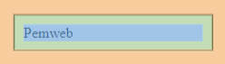

---

#### **4. Tinggi & Lebar (Height & Width)**

Kalian bisa menetapkan tinggi dan lebar elemen menggunakan properti `height` dan `width`.

Contoh:
```html
<div class="kotak">
  <div style="display: flex; justify-content: center; align-items: center;">
    <p >Lebar = 300px</p>
  </div>
  
  <p style="margin-left: 1rem;">Panjang = 150px</p>
</div>

<style>
  .kotak {
    width: 300px;
    height: 150px;
    background-color: lightcoral;
  }
</style>
```
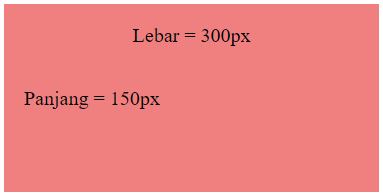
---

#### **5. Warna (Color)**

Properti `color` mengubah warna teks, sedangkan `background-color` mengubah warna latar belakang.

Contoh:
```html
<p class="teks-berwarna">woh berwarna cik</p>

<style>
  .teks-berwarna {
    color: #3498db; /* Warna teks */
    background-color: #f1c40f; /* Warna latar belakang */
  }
</style>
```

---

#### **6. Teks & Font**

kalian bisa menata teks menggunakan properti seperti `font-size`, `font-family`, `text-align`, `line-height`, dan lainnya.

Contoh:
```html
<p class="text">Pemweb seru ya ges ya</p>

<style>
  .teks-styling {
    font-size: 20px;
    font-family: 'Arial', sans-serif;
    text-align: center;
    line-height: 1.5;
  }
</style>
```


#### **11. Flex**

Flexbox adalah metode tata letak CSS yang memudahkan distribusi ruang dan penjajaran elemen dalam kontainer dengan cara yang lebih efisien dibandingkan metode tata letak tradisional. Flexbox dirancang untuk mengatasi masalah tata letak yang kompleks dengan cara yang lebih mudah, memungkinkan elemen dalam kontainer untuk menyesuaikan diri secara otomatis berdasarkan ruang yang tersedia.

Konsep Utama Flexbox:

1) Kontainer Flex (Flex Container): Elemen yang diatur menggunakan Flexbox dengan `display: flex;` atau `display: inline-flex;`. Semua anak elemen dari kontainer ini akan menjadi item flex.

2) Item Flex (Flex Items): Elemen di dalam kontainer flex yang secara otomatis menyesuaikan ukuran dan posisinya berdasarkan properti Flexbox yang diterapkan pada kontainer.

3) Sumbu Utama (Main Axis): Arah utama di mana item flex ditempatkan dalam kontainer. Arah ini bisa horizontal (default) atau vertikal, tergantung pada nilai flex-direction.

4) Sumbu Silang (Cross Axis): Arah yang tegak lurus terhadap sumbu utama. Ini digunakan untuk mengatur penempatan item flex di sepanjang sumbu yang berbeda dari sumbu utama.

5) Properti Kontainer Flex:
    - `flex-direction`: Mengatur arah sumbu utama (misalnya, baris horizontal atau kolom vertikal).

    - `flex-wrap`: Menentukan apakah item flex harus dibungkus ke baris atau kolom berikutnya jika ruang tidak cukup.

    - `justify-content`: Mengatur distribusi ruang sepanjang sumbu utama (misalnya, penempatan di tengah, spasi antara, atau spasi di sekeliling).

    - `align-items`: Menentukan bagaimana item flex diatur di sepanjang sumbu silang (misalnya, pusatkan, atau perataan di awal atau akhir).

    - `align-content`: Mengatur ruang di antara baris flex saat kontainer memiliki banyak baris (misalnya, spasi antara, atau meratakan di pusat).

6) Properti Item Flex:
    - `flex-grow`: Mengatur seberapa banyak item flex akan tumbuh relatif terhadap item lainnya jika ada ruang ekstra.

    - `flex-shrink`: Mengatur seberapa banyak item flex akan menyusut relatif terhadap item lainnya jika ruang terbatas.

    - `flex-basis`: Menentukan ukuran awal item flex sebelum `flex-grow` atau `flex-shrink` diterapkan.


Contoh:
```html
<div class="container">
  <div class="item">Item 1</div>
  <div class="item">Item 2</div>
  <div class="item">Item 3</div>
</div>
```

```css
<style>
    .container {
      display: flex;
      justify-content: center;
      align-items: center;
      height: 100vh;
      background-color: #f0f0f0;
    }

    .item {
      background-color: lightcoral;
      color: white;
      padding: 20px;
      margin: 10px;
      border-radius: 5px;
    }
</style>
```

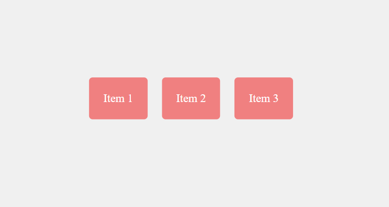

#### **12. Grid**

CSS Grid Layout adalah sistem tata letak dua dimensi yang memungkinkan untuk membuat desain yang kompleks dan responsif dengan mudah. Grid Layout membagi area halaman menjadi baris dan kolom, sehingga bisa menempatkan elemen di dalam grid dengan cara yang lebih fleksibel dibandingkan metode lain.

Konsep Utama Grid Layout:

1) Kontainer Grid (Grid Container): Elemen yang diatur menggunakan Grid Layout dengan `display: grid;` atau `display: inline-grid;`. Elemen anak dari kontainer ini akan menjadi item grid.

2) Item Grid (Grid Items): Elemen di dalam kontainer grid yang akan diatur dalam baris dan kolom berdasarkan aturan grid.

3) Baris dan Kolom (Grid Rows and Columns): Grid Layout membagi kontainer menjadi baris dan kolom. Dapat mengatur ukuran baris dan kolom serta mengatur penempatan item di dalam grid.

4) Properti Kontainer Grid:
    - `grid-template-rows`: Menentukan ukuran baris grid. Menggunakan satuan seperti px, %, atau fr (fractional unit).

    - `grid-template-columns`: Menentukan ukuran kolom grid

    - `grid-template-areas`: Mengatur area grid dengan mendefinisikan nama area untuk memudahkan penempatan item grid

    - `grid-gap`: Menentukan jarak antara baris dan kolom grid

5) Properti Item Grid:
    - `grid-column`: Menentukan berapa banyak kolom item grid akan mencakup

    - `grid-row`: Menentukan berapa banyak baris item grid akan mencakup.

    - `grid-area`: Mengatur posisi item grid berdasarkan nama area atau posisi grid.

Contoh:

```html
  <div class="grid-container">
    <div class="header">Header</div>
    <div class="sidebar">Sidebar</div>
    <div class="main">Main Content</div>
    <div class="footer">Footer</div>
  </div>
```

```css
  <style>
    .grid-container {
      display: grid;
      grid-template-rows: 100px auto 100px;
      grid-template-columns: 1fr 3fr;
      grid-gap: 10px;
    }

    .header {
      grid-column: 1 / 3;
      background-color: lightblue;
      padding: 20px;
    }

    .sidebar {
      background-color: lightcoral;
      padding: 20px;
    }

    .main {
      background-color: lightgreen;
      padding: 20px;
    }

    .footer {
      grid-column: 1 / 3;
      background-color: lightgoldenrodyellow;
      padding: 20px;
    }
  </style>
```

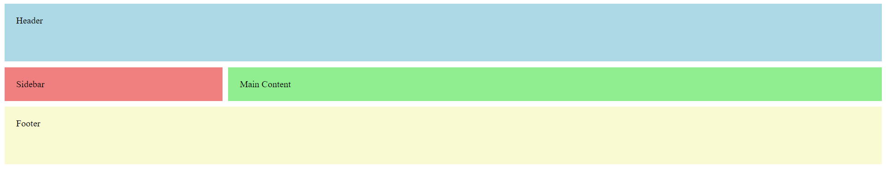

#### **13. Responsive**

Responsive Layout adalah pendekatan desain web yang memastikan tampilan dan fungsionalitas halaman web tetap baik di berbagai ukuran layar, mulai dari desktop besar hingga perangkat mobile kecil. Dengan responsive layout, desain halaman web dapat menyesuaikan diri dengan lebar viewport perangkat yang berbeda.

Konsep utama responsive layout:

  1) **Media Queries**: Media queries adalah fitur CSS untuk menerapkan gaya khusus berdasarkan ukuran layar perangkat. Media queries digunakan untuk menentukan aturan CSS yang hanya diterapkan jika kondisi tertentu terpenuhi.

      Contoh penggunaan media queries:
      ```css
      /* Style default */
      body {
      font-size: 16px;
      }

      /* Style dengan lebar max 600px */
      @media (max-width: 600px) {
        body {
          font-size: 14px;
        }
      }
      ```

  2) **Unit Responsif**: Menggunakan unit ukuran responsif seperti em, rem, %, dan vh/vw (viewport height/width) memungkinkan elemen untuk menyesuaikan ukuran dan posisi mereka sesuai dengan ukuran viewport

      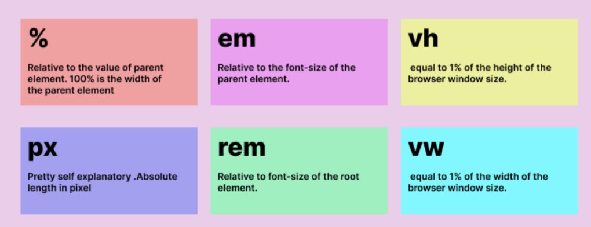

      Contoh penggunaan unit responsif:
      ```css
      .container {
      width: 80%;
      padding: 2rem;
      }
      ```

  3) **Responsive Grid & Flexbox** :  Menggunakan Grid Layout dan Flexbox dapat mempermudah penciptaan tata letak responsif dengan fleksibilitas tinggi. Dengan metode ini, arah baris/kolom dapat diubah, elemen dapat disembunyikan atau ditampilkan, dan ukuran item grid/flex dapat disesuaikan berdasarkan ukuran layar.

        Contoh responsive flexbox:
        
        ```css
            .container {
            display: flex;
            flex-wrap: wrap;
            }

            .item {
            flex: 1 1 200px; /* Item akan menyesuaikan dengan ukuran minimum 200px */
            }

      ```

      Contoh responsive gridbox: 
      
      ```css
      .grid-container {
      display: grid;
      grid-template-columns: repeat(3, 1fr);
      }

      /* Style untuk device dengan lebar layar max 768px */
      @media (max-width: 768px) {
        .grid-container {
        grid-template-columns: repeat(2, 1fr);
        }
      }

      /* Style untuk device dengan lebar layar max 480px */
      @media (max-width: 480px) {
        .grid-container {
          grid-template-columns: 1fr;
        }
      }
      ```

  5) **Responsive Image**: Menggunakan gambar responsif yang dapat menyesuaikan ukuran dan resolusi mereka sesuai dengan perangkat yang digunakan. Dapat menggunakan atribut `srcset` dan `sizes` pada elemen ``

      Contoh penggunaan `srcset` dan `sizes`:
      ```css
      
      ```

Contoh responsive layout:
```html
  <div class="container">
    <div class="item">Item 1</div>
    <div class="item">Item 2</div>
    <div class="item">Item 3</div>
  </div>
```
```css
  <style>
    .container {
      display: grid;
      grid-template-columns: repeat(3, 1fr);
      gap: 10px;
    }

    .item {
      background-color: lightcoral;
      padding: 20px;
    }

    @media (max-width: 768px) {
      .container {
        grid-template-columns: repeat(2, 1fr);
      }
    }

    @media (max-width: 480px) {
      .container {
        grid-template-columns: 1fr;
      }
    }
  </style>
```

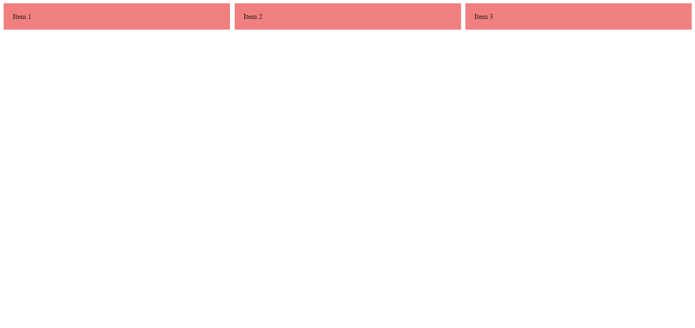 <br>
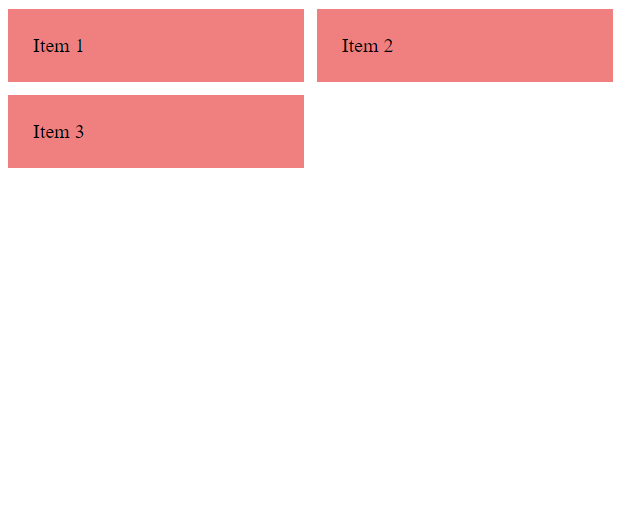 <br>
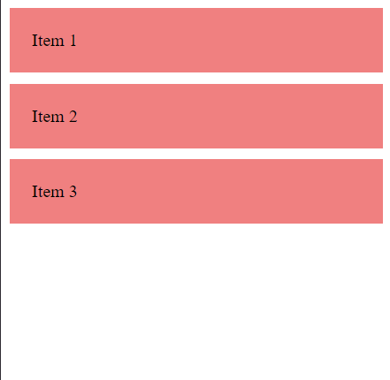 <br>