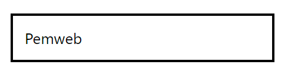
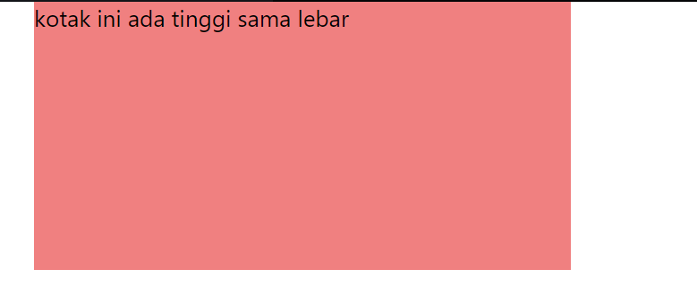
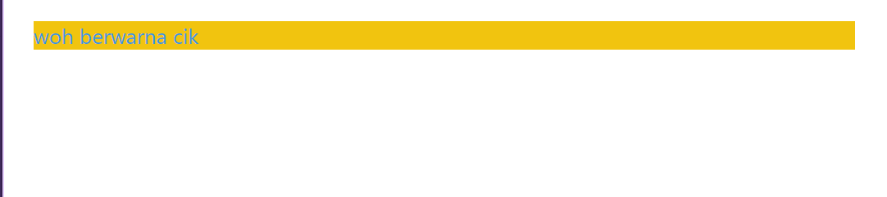

# Modul 1 - HTML dan CSS
### 🎨 **CSS**

#### **1. Cara Menyisipkan CSS**

Ada tiga cara untuk menyisipkan CSS ke dalam dokumen HTML:

- **Inline CSS**: CSS diterapkan langsung ke elemen HTML menggunakan atribut `style`.
  
  ```html
  <p style="color: red;">Ini adalah paragraf berwarna merah.</p>
  ```

- **Internal CSS**: CSS diletakkan di dalam tag `<style>` pada bagian `<head>` dokumen HTML.
  
  ```html
  <head>
    <style>
      p {
        color: blue;
      }
    </style>
  </head>
  ```

- **Eksternal CSS**: CSS disimpan dalam file terpisah dan dihubungkan ke HTML menggunakan tag `<link>`.
  
  ```html
  <!DOCTYPE html>
  <html>
  <head>
  <link rel="stylesheet" href="mystyle.css">
  </head>
  <body>

  <h1>Pemweb seru gasi</h1>
  <p>seru banget kak</p>

  </body>
  </html>

  ```

---

#### **2. Selektor (Menghubungkan Class & Id)**

Selektor CSS digunakan untuk menargetkan elemen HTML tertentu buat dikasih *style*. Dua selektor utama adalah **class** dan **id**.

- **Class Selector**: Menargetkan elemen dengan kelas tertentu.
  
  ```html
  <div class="kotak">Kotak 1</div>
  <div class="kotak">Kotak 2</div>
  
  /* CSS */
  .kotak {
    background-color: lightblue;
    padding: 10px;
  }
  ```

- **ID Selector**: Menargetkan elemen unik dengan ID tertentu.
  
  ```html
  <div id="kotakID">Kotak Utama</div>
  
  /* CSS */
  #kotakID {
    background-color: green;
    padding: 20px;
  }
  ```

---

#### **3. Box Model (Margin, Padding, Border, Konten)**

**Box model** dalam CSS terdiri dari **konten**, **padding**, **border**, dan **margin**. Memahami model ini penting untuk tata letak halaman.

- **Konten**: Isi dari elemen (teks, gambar, dll.).
- **Padding**: Ruang antara konten dan border.
- **Border**: Garis yang mengelilingi padding dan konten.
- **Margin**: Ruang di luar border, antara elemen lain.

Contoh:
```html
<div class="kotak">Pemweb</div>

<style>
  .kotak {
    width: 200px;
    padding: 10px;
    border: 2px solid black;
    margin: 20px;
  }
</style>
```


---

#### **4. Tinggi & Lebar (Height & Width)**

Kalian bisa menetapkan tinggi dan lebar elemen menggunakan properti `height` dan `width`.

Contoh:
```html
<div class="kotak">kotak ini ada tinggi sama lebar</div>

<style>
  .kotak {
    width: 300px;
    height: 150px;
    background-color: lightcoral;
  }
</style>
```

---

#### **5. Warna (Color)**

Properti `color` mengubah warna teks, sedangkan `background-color` mengubah warna latar belakang.

Contoh:
```html
<p class="teks-berwarna">woh berwarna cik</p>

<style>
  .teks-berwarna {
    color: #3498db; /* Warna teks */
    background-color: #f1c40f; /* Warna latar belakang */
  }
</style>
```

---

#### **6. Teks & Font**

kalian bisa menata teks menggunakan properti seperti `font-size`, `font-family`, `text-align`, `line-height`, dan lainnya.

Contoh:
```html
<p class="text">Pemweb seru ya ges ya</p>

<style>
  .teks-styling {
    font-size: 20px;
    font-family: 'Arial', sans-serif;
    text-align: center;
    line-height: 1.5;
  }
</style>
```
