# Modul 3 - Express JS dan MongoDB

## Pendahuluan

Stack (kombinasi) yang digunakan pada modul back-end ini adalah:

<p><strong>NodeJS + ExpressJS + TypeScript + MongoDB</strong></p>

- `NodeJS + ExpressJS`


- `TypeScript`


- `MongoDB`


## TypeScrypt

### Apa itu TypeScript🤔???

TypeScript adalah sebuah **bahasa pemrograman yang dikembangkan di atas JavaScript**. Dibandingkan dengan JavaScript, TypeScript menyediakan fitur tambahan yang mempermudah pengembangan aplikasi berskala besar.

TypeScript adalah superset dari JavaScript, yang berarti **semua kode JavaScript yang valid juga valid di TypeScript**. Namun, TypeScript menambahkan syntax tambahan seperti tipe data (**type**) dan antarmuka (**interface**) untuk memberikan lebih banyak struktur pada kode.

Proses Transpilasi kode yang ditulis dalam TypeScript tidak dijalankan langsung di browser atau Node.js. Kode ini perlu dikonversi menjadi JavaScript terlebih dahulu melalui proses yang disebut transpiling. Setelah dikonversi, hasilnya adalah kode JavaScript biasa yang dapat dijalankan di:

- **Browser**: Untuk membuat aplikasi web.

- **Node.js atau Deno**: Untuk membuat aplikasi server atau utilitas lain berbasis JavaScript.

### Mengapa Typescript😣???

- **Integrasi IDE**

  TypeScript dirancang untuk bekerja lebih baik dengan Code Editor seperti VS Code, sehingga memudahkan dalam penulisan dan perbaikan kode.

- **Error Checking**

  Salah satu keuntungan utama TypeScript adalah kemampuannya untuk menangkap kesalahan langsung saat penulisan kode, sehingga bug dapat diperbaiki sebelum program dijalankan.

- **Scalable**

  TypeScript sangat berguna dalam proyek berskala besar karena adanya tipe data yang lebih jelas, sehingga memudahkan pengembang dalam memahami dan menjaga kualitas kode.

### Javascript😁 vs Typescript😎

| **Fitur**             | **TypeScript**                                                                  | **JavaScript**                                        |
| --------------------- | ------------------------------------------------------------------------------- | ----------------------------------------------------- |
| **Tipe Data**         | Menyediakan tipe statis                                                         | Bertipe dinamis                                       |
| **Perkakas**          | Dilengkapi dengan IDE dan editor kode                                           | Tools bawaan terbatas                                 |
| **Sintaks**           | Mirip dengan JavaScript, dengan fitur tambahan                                  | Syntax Standar JavaScript standar                     |
| **Kompatibilitas**    | Kompatibel dengan JavaScript                                                    | Tidak dapat menjalankan TypeScript di file JavaScript |
| **Debugging**         | Penulisan kode yang lebih kuat/strict dapat membantu mengidentifikasi kesalahan | Memerlukan lebih banyak debugging dan pengujian       |
| **Tingkat Kesulitan** | Membutuhkan waktu untuk mempelajari fitur tambahan                              | Sintaks JavaScript standar lebih familier             |
| **Tipe Bahasa**       | Object-oriented                                                                 | Prototype-based language                              |

1. Deklarasi Variabel dengan Tipe Data

- **JavaScript**: Tidak menggunakan tipe data statis.

- **TypeScript**: Mendukung tipe data statis dengan anotasi tipe.

```typescript
// JavaScript
let name = "John"; // Tipe data ditentukan saat runtime

// TypeScript
let name: string = "John"; // Tipe data string secara eksplisit
```

2. Fungsi dengan Tipe Parameter dan Return

- **JavaScript**: Tidak menentukan tipe data pada parameter dan nilai yang dikembalikan.

- **TypeScript**: Memungkinkan penentuan tipe data untuk parameter dan nilai kembalian.

```typescript
// JavaScript
function add(a, b) {
  return a + b;
}

// TypeScript
function add(a: number, b: number): number {
  return a + b;
}
```

3. Interface

- JavaScript: Tidak memiliki konsep interface.
- TypeScript: Menyediakan interface untuk mendefinisikan bentuk objek secara eksplisit.

```javascript
// TypeScript
interface Person {
  name: string;
  age: number;
}

let person: Person = {
  name: "Alice",
  age: 25,
};
```

4. Class dan Properti

- **JavaScript**: Tidak menggunakan tipe pada properti dan tidak mendukung akses modifier secara langsung.

- **TypeScript**: Mendukung tipe pada properti dan akses modifier seperti public, private, dan protected.

```typescript
// JavaScript
class Animal {
  constructor(name) {
    this.name = name;
  }
}

let dog = new Animal("Dog");

// TypeScript
class Animal {
  private name: string;

  constructor(name: string) {
    this.name = name;
  }

  public getName(): string {
    return this.name;
  }
}

let dog: Animal = new Animal("Dog");
```

1. Type Assertions

- **JavaScript**: Tidak mendukung asersi tipe.

- **TypeScript**: Mendukung asersi tipe untuk menyatakan bahwa suatu nilai adalah tipe tertentu.

```typescript
// TypeScript
let value: any = "Hello World";
let lengthOfString: number = (value as string).length; // Asersi bahwa value adalah string
```

6. Optional Parameters

- **JavaScript**: Tidak memiliki fitur parameter opsional secara eksplisit.

- **TypeScript**: Mendukung parameter opsional dengan tanda ?.

```typescript
// TypeScript
function greet(name: string, age?: number): string {
  return age ? `Hello ${name}, age ${age}` : `Hello ${name}`;
}
```

7. Generics

- **JavaScript**: Tidak mendukung generics.

- **TypeScript**: Mendukung penggunaan generics untuk fungsi atau class yang fleksibel dengan berbagai tipe.

```typescript
// TypeScript
function identity<T>(arg: T): T {
  return arg;
}

let output = identity<string>("Hello"); // Menggunakan generics dengan tipe string
```

## ExpressJS

**`ExpressJS`** merupakan salah satu framework nodeJS populer yang digunakan untuk membuat aplikasi web dan API. Framework ini digunakan dengan tujuan agar developer tidak perlu membuat Back-End _from scratch_ dan menghabiskan waktu mereka hanya untuk mengurus kode - kode inisiasi.

Dengan adanya framework seperti ExpressJS ini, maka developer dapat lebih berfokus pada pengerjaan _bussiness logic_ untuk aplikasi web yang akan dibuat.

### Cara Melakukan Inisiasi Project ExpressJS

Sebelum memulai proyek express, pastikan kalian telah menginstal `NodeJS` dan package manager NodeJS seperti `npm`, `yarn`, atau `pnpm`

#### **Cara Menginstal `NodeJS`**

- Download _prebuilt-installer_ NodeJS (gunakan versi yang memiliki label `LTS`) pada [link berikut](https://nodejs.org/en/download/prebuilt-installer). Nantinya akan muncul tampilan seperti di bawah ini
  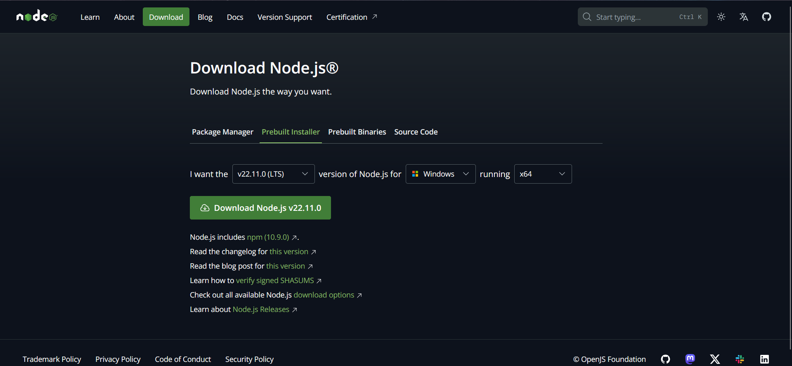

- Install nodeJS melalui _prebuilt-installer_ yang sudah kalian unduh.

- Package Manager `NPM` juga akan terinstal.

- untuk memeriksa apakah `NodeJS` dan `NPM` telah terpasang, gunakan command berikut pada terminal:

  - Cek versi `NodeJS`

  ```bash
  node -v
  ```

  - Cek versi `NPM`

  ```bash
  npm -v
  ```

  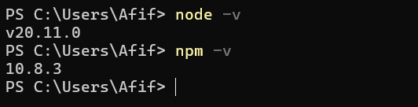

#### **Cara Menginstal `Yarn` (Opsional)**

Menginstal Package Manager `Yarn` dapat dilakukan dengan menggunakan perintah dari `NPM`.

- Jalankan command berikut pada terminal:

  ```bash
  npm install -g yarn
  ```

  > Catatan: flag `-g` perlu digunakan agar yarn dapat digunakan di lokasi manapun pada komputer kalian.

- Periksa versi yarn menggunakan perintah berikut:

  ```bash
  yarn -v
  ```

  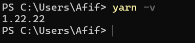

#### **Cara Menginstal `PNPM` (Opsional)**

Menginstal Package Manager `PNPM` dapat dilakukan dengan menggunakan perintah dari `NPM`.

- Jalankan command berikut pada terminal:

  ```bash
  npm install -g pnpm
  ```

  > Catatan: flag `-g` perlu digunakan agar pnpm dapat digunakan di lokasi manapun pada komputer kalian.

- Periksa versi pnpm menggunakan perintah berikut:

  ```bash
  pnpm -v
  ```

  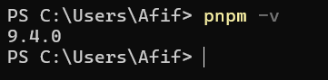

#### **Inisiasi Proyek ExpressJS + TypeScript**

Pada bagian ini akkan dijelaskan bagaimana cara melakukan setup project Express + TypeScript. Perhatikan langkah - langkahnya.

1. Buka terminal pada IDE kalian, kemudian mulai inisiasi proyek menggunakan `Package Manager` pilihan kalian.

```bash
# Menggunakan NPM
npm init

# Menggunakan yarn
yarn init

# Menggunakan PNPM
pnpm init
```

Jawab pertanyaan yang diberikan. Jawaban dari pertanyaan tidak akan memengaruhi hasil dari proyek. hasilnya akan tampak seperti berikut:

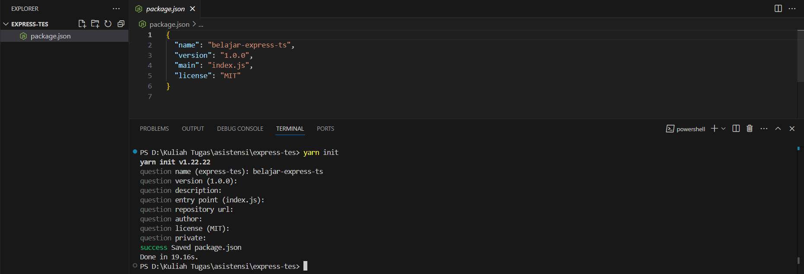

> **`Tambahan`**: buat file `.gitignore` kemudian isi dengan teks `node_modules` agar folder node_module tidak ikut masuk ke github.

2. Instal dependensi `ExpressJS`

```bash
# Menggunakan NPM
npm install express

# Menggunakan yarn
yarn add express

# Menggunakan PNPM
pnpm i express
```

3. Instal juga dependensi `typescript`, `@types/node`, `ts-node`, `nodemon` dan `@types/express` kali ini dengan flag `-D`

```bash
# Menggunakan NPM
npm install -D typescript @types/node @types/express ts-node nodemon

# Menggunakan yarn
yarn add -D typescript @types/node @types/express ts-node nodemon

# Menggunakan PNPM
pnpm i -D typescript @types/node @types/express ts-node nodemon
```

> Dependencies merupakan list package yang diperlukan oleh aplikasi untuk berjalan (pada tahap production), sementara devDependencies merupakan list package yang digunakan khusus pada saat tahap pengembangan (development) atau testing

4. Buat file `tsconfig.json` untuk mengatur compiler typescript

```bash
npx tsc --init
```

Nantinya akan muncul sebuah file bernama `tsconfig.json` yang isinya berbagai macam konfigurasi yang dapat digunakan pada compiler typescript nantinya.

Namun untuk mempermudah pengaturan, kalian bisa hapus semua isi dari file `tsconfig.json` kemudian isi dengan pengaturan di bawah ini

```json
{
  "compilerOptions": {
    "module": "commonjs",
    "declaration": true,
    "removeComments": true,
    "emitDecoratorMetadata": true,
    "experimentalDecorators": true,
    "allowSyntheticDefaultImports": true,
    "target": "ES2021",
    "sourceMap": true,
    "noEmit": false,
    "outDir": "./dist",
    "baseUrl": "./src",
    "skipLibCheck": true,
    "strict": true,
    "strictNullChecks": false,
    "noImplicitAny": true,
    "strictBindCallApply": true,
    "forceConsistentCasingInFileNames": false,
    "noFallthroughCasesInSwitch": false,
    "strictPropertyInitialization": false,
    "esModuleInterop": true,
    "moduleResolution": "node",
    "resolveJsonModule": true,
    "isolatedModules": true
  }
}
```

5. Buat folder bernama `src` kemudian buat pula file di dalam src dengan nama `index.ts`

Struktur direktori saat ini seharusnya berbentuk seperti pada di bawah ini.

```
./
├───node_modules/
├───src/
│     index.ts
│
│ package.json
│ yarn.lock
```

> file yarn.lock akan berbeda - beda sesuai dengan package manager yang kalian gunakan

6. Lakukan inisiasi express pada file `index.ts`. file ini akan menjadi file utama kita pada proyek ini

```javascript
import express from "express";

const app = express();

app.use(express.json());

// check endpoint
app.get("/", (_, response) => {
  response.status(200).send("Server is up and running 💫");
});

const PORT = 4000;
app.listen(PORT, () => {
  console.log(`Express is running on Port ${PORT}`);
});
```

7. Siapkan script untuk menjalankan website.

Pada file `package.json`, tambahkan script sesuai dengan teks di bawah agar website dapat dijalankan.

```json
"scripts": {
  "build": "tsc --build",
  "start": "node ./dist/index.js",
  "start:dev": "nodemon ./src/index.ts"
},
```

Hasilnya akan tampak seperti ini

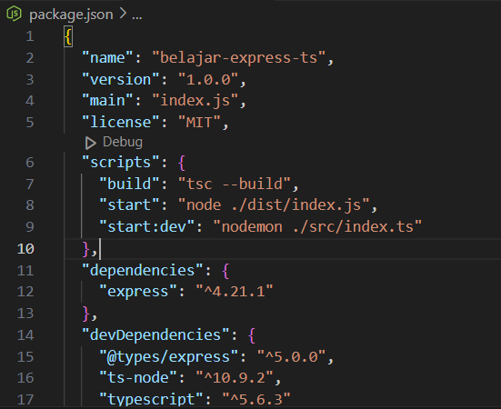

8. Jalankan website dengan command berikut

```bash
# Menggunakan NPM
npm run start:dev

# Menggunakan yarn
yarn start:dev

# Menggunakan PNPM
pnpm start:dev
```

9. Buka website kalian pada `http://localhost:PORT` dengan `PORT` merupakan nilai PORT yang sudah kalian deklarasikan pada file `index.ts`


10. Selamat, kalian telah membuat endpoint pertama kalian menggunakan `ExpressJS + TypeScript`

11. Script `build` dan `start` merupakan command yang digunakan pada tahap production, namun modul ini tidak akan membahas expressJS pada tahap production.

### Express Router

Express Router adalah cara untuk memisahkan dan mengorganisasi rute API dalam aplikasi Express. Dengan menggunakan Router, kita dapat membuat endpoint yang lebih terstruktur dan modular, memungkinkan kita untuk mengelompokkan rute berdasarkan fungsionalitas, misalnya rute untuk "users" atau "products."

Dari proyek yang sudah kita buat sebelumnya, kali ini kita akan mengubah strukturnya menjadi `Function Based Structure`.

1. Buat folder `router` pada `src` kemudian isi dengan file `index.ts` dan `food.router.ts`

Strukturnya akan tampak seperti berikut:

```
./
├───node_modules/
├───src/
│     ├───router/
│     │   ├─food.router.ts
│     │   │ index.ts
│     │
│     │ index.ts
│
│ package.json
│ yarn.lock
```

2. Selanjutnya, kita akan isi `food.router.ts` dengan beberapa endpoint

```typescript
import express from "express";

const router = express.Router();

router.get("/pizza", (_, res) => {
  res.status(200).send("Mmm... Pizza... 🍕");
});

router.get("/cookie", (_, res) => {
  res.status(200).send("Get some Cookie... 🍪");
});

router.get("/donut", (_, res) => {
  res.status(200).send("Do Not... 🍩");
});

export default router;
```

3. Panggil food router yang sudah dibuat sebelumnya pada file `router/index.ts`

```typescript
import express from "express";
const router = express.Router();

import foodRouter from "./food.router";

router.use("/food", foodRouter);

export default router;
```

4. Terakhir, gunakan router sebelumnya pada file `src/index.ts` dengan mengubah sebagian dari isinya

```typescript
import express from "express";
import router from "./router"; // import routernya

const app = express();

app.use(express.json());

// check endpoint
app.get("/", (_, response) => {
  response.status(200).send("Server is up and running 💫");
});

app.use(router); // tambahkan baris ini untuk menggunakan router

const PORT = 4000;
app.listen(PORT, () => {
  console.log(`Express is running on Port ${PORT}`);
});
```

5. Sekarang apabila kalian menjalankan websitenya, kalian akan mendapati beberapa endpoint baru.

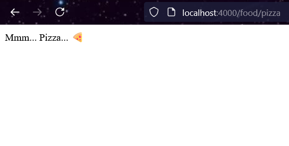

Selain `Get`, express juga mendukung berbagai metode lain seperti `Post`, `Patch`, `Put`, dan `Delete`. Berikut untuk lebih jelasnya.

#### **`GET`**

Metode GET digunakan untuk mengambil data dari server. Biasanya, metode ini digunakan untuk membaca atau mengakses data yang tersedia.

Contoh Kode:

```typescript
// Rute GET untuk mendapatkan semua data pengguna
router.get("/users", (req: Request, res: Response) => {
  res.status(200).json({ message: "Retrieve all users" });
});

// Rute GET untuk mendapatkan data spesifik dari pengguna berdasarkan ID
router.get("/users/:id", (req: Request, res: Response) => {
  const { id } = req.params;
  res.status(200).json({ message: `Retrieve user with ID: ${id}` });
});
```

#### **`POST`**

Metode POST digunakan untuk mengirim data baru ke server, biasanya digunakan untuk menambah data baru.

Contoh Kode:

```typescript
// Rute POST untuk menambah pengguna baru
router.post("/users", (req: Request, res: Response) => {
  const { name, email } = req.body;
  res.status(201).json({ message: "User created", data: { name, email } });
});
```

#### **`PATCH`**

Metode PATCH digunakan untuk memperbarui sebagian data pada sumber daya yang ada. Metode ini digunakan ketika kita hanya ingin memperbarui sebagian dari data.

Contoh Kode:

```typescript
// Rute PATCH untuk memperbarui sebagian data pengguna berdasarkan ID
router.patch("/users/:id", (req: Request, res: Response) => {
  const { id } = req.params;
  const { email } = req.body;
  res
    .status(200)
    .json({ message: `User with ID: ${id} updated`, data: { email } });
});
```

#### **`PUT`**

Metode PUT digunakan untuk memperbarui data secara menyeluruh pada sumber daya yang ada. Semua data biasanya ditimpa dengan data baru yang dikirimkan.

Contoh Kode:

```typescript
// Rute PUT untuk memperbarui data pengguna secara menyeluruh berdasarkan ID
router.put("/users/:id", (req: Request, res: Response) => {
  const { id } = req.params;
  const { name, email } = req.body;
  res
    .status(200)
    .json({ message: `User with ID: ${id} replaced`, data: { name, email } });
});
```

#### **`DELETE`**

Metode DELETE digunakan untuk menghapus data dari server.

Contoh Kode:

```typescript
// Rute DELETE untuk menghapus pengguna berdasarkan ID
router.delete("/users/:id", (req: Request, res: Response) => {
  const { id } = req.params;
  res.status(200).json({ message: `User with ID: ${id} deleted` });
});
```

### Express Request

Pada `Express`, objek **Request** digunakan untuk **menyimpan semua informasi yang dikirimkan** oleh klien saat mengakses endpoint tertentu. Objek ini memiliki berbagai properti yang memungkinkan kita untuk mengakses data yang dikirimkan, seperti header, parameter, body, dan query.

#### **Request Head**

Request Head atau header permintaan adalah metadata yang dikirimkan dari klien ke server dalam bentuk key-value pair. Header ini dapat digunakan untuk memberikan informasi tambahan seperti jenis konten (Content-Type), otorisasi (Authorization), atau custom header lainnya.

Contoh Kode:

```typescript
router.get("/headers", (req: Request, res: Response) => {
  const contentType = req.headers["content-type"];
  const authorization = req.headers["authorization"];

  res.status(200).json({
    message: "Headers received",
    headers: { contentType, authorization },
  });
});
```

#### **Request Body**

Request Body berisi data yang dikirimkan oleh klien ke server, biasanya melalui metode POST, PUT, atau PATCH. Body umumnya berisi data yang ingin disimpan atau diperbarui, seperti data pengguna atau data formulir.

Contoh Kode:

```typescript
router.post("/data", (req: Request, res: Response) => {
  const { name, email } = req.body;

  res.status(201).json({
    message: "Data received",
    data: {
      name,
      email,
    },
  });
});
```

#### **Request Param**

Request Param digunakan untuk mengambil data dari URL yang bersifat dinamis, biasanya pada bagian path. Data ini sering digunakan untuk menentukan sumber daya spesifik, seperti ID pengguna atau produk.

Contoh Kode:

```typescript
router.get("/users/:id", (req: Request, res: Response) => {
  const { id } = req.params;

  res.status(200).json({
    message: `User with ID: ${id} found`,
  });
});
```

#### **Request Query**

Request Query digunakan untuk mendapatkan parameter tambahan dari URL, biasanya untuk menambahkan filter atau opsi tambahan dalam permintaan. Query parameters ditambahkan setelah tanda ? di URL dan sering digunakan untuk menentukan opsi seperti pencarian atau pagination.

Contoh Kode:

```typescript
router.get("/search", (req: Request, res: Response) => {
  const { keyword, page, limit } = req.query;

  res.status(200).json({
    message: "Search results",
    filters: {
      keyword,
      page: Number(page),
      limit: Number(limit),
    },
  });
});
```

### Express Response

objek Response digunakan untuk mengirimkan respons dari server ke klien setelah permintaan diproses. Melalui objek ini, kita dapat menentukan data apa yang akan dikembalikan, status kode HTTP, tipe konten, serta mengatur header lain yang dibutuhkan klien. Menggunakan Response, kita juga dapat mengirimkan respons dalam berbagai format, seperti JSON, HTML, atau teks biasa.

#### **Http Status Code**

Kode status HTTP adalah angka yang menunjukkan status hasil permintaan klien. Kode ini membantu klien memahami apakah permintaan berhasil, dialihkan, atau mengalami error. Berikut adalah beberapa kategori utama kode status HTTP yang sering digunakan:

- Code `2XX`:

  Kode status 2XX menunjukkan bahwa **permintaan berhasil**. Kode ini digunakan saat data dikirimkan dengan benar atau saat operasi selesai dengan sukses. Contoh kode 2XX yang sering digunakan adalah `200 OK`, `201 Created`, dan `204 No Content`.

- Code `3XX`:

  Kode status 3XX digunakan untuk mengindikasikan bahwa **permintaan harus dialihkan ke lokasi lain**. Ini sering digunakan untuk redirect, seperti saat konten berpindah ke URL baru. Contoh kode 3XX yang sering digunakan adalah `301 Moved Permanently`, `302 Found`, dan `304 Not Modified`.

- Code `4XX`:

  Kode status 4XX menunjukkan **kesalahan di sisi klien**. Kode ini berarti bahwa permintaan tidak dapat diproses karena masalah yang disebabkan oleh klien, seperti kesalahan autentikasi atau data yang tidak valid. Contoh kode 4XX yang sering digunakan adalah `400 Bad Request`, `401 Unauthorized`, dan `404 Not Found`.

- Code `5XX`:

  Kode status 5XX menunjukkan bahwa terjadi **kesalahan di sisi server**. Hal ini biasanya berarti bahwa server tidak dapat memenuhi permintaan karena masalah internal atau gangguan pada server. Contoh kode 5XX yang sering digunakan adalah `500 Internal Server Error`, `502 Bad Gateway`, dan `503 Service Unavailable`.

#### **Cara Membuat Response yang Sesuai**

Response yang baik berarti memiliki informasi yang lengkap dan mudah untuk dibaca. Umumnya response selalu dikembalikan dalam bentuk `JSON` yang isinya seperti berikut:

- `message`: string yang menjelaskan response tersebut. Misalkan `success get all user data` atau `user not found`

- `status`: Boolean (true / false) yang menunjukkan apakah permintaan berhasil atau tidak. Status seharusnya sudah direpresentasikan dalam bentuk kode HTTP, namun karena variasi kode HTTP sangat banyak, maka status ini berfungsi untuk mengerucutkannya menjadi tanda sukses atau tidak.

- `data`: Objek yang berisi semua data yang diminta klien

- `metadata (opsional)`: Metadata biasanya digunakan pada permintaan yang memiliki pagination dan sejenisnya. Metadata menunjukkan bagaimana kondisi data yang diberikan.

## MongoDB

MongoDB adalah sistem manajemen basis data NoSQL yang bersifat open-source dan dikembangkan oleh MongoDB Inc. Basis data ini menyimpan data dalam format dokumen BSON (Binary JSON) yang mirip dengan JSON, menjadikannya fleksibel dalam menyimpan data semi-terstruktur dan tidak terstruktur. Tidak seperti basis data relasional (RDBMS) yang menggunakan tabel dan kolom, MongoDB menggunakan koleksi (collections) dan dokumen (documents) untuk menyimpan data, sehingga lebih mudah beradaptasi dengan perubahan struktur data tanpa memerlukan migrasi database yang kompleks.

### Mengapa MongoDB?

MongoDB memiliki layanan bernama `Mongo Atlas` yang memungkinkan pengguna untuk membuat database Mongo melalui cloud, sehingga pengguna tidak perlu menginstal MongoDB secara lokal untuk membuat database.

`Mongo Atlas` juga memiliki versi gratis yang bisa digunakan dengan limit penyimpanan sebesar `512 MB`

### **Cara Konfigurasi Akun `Mongo Atlas`**

1. Masuk ke [website MongoDB](https://www.mongodb.com/) kemudian tekan tombol `Try Atlas Free`

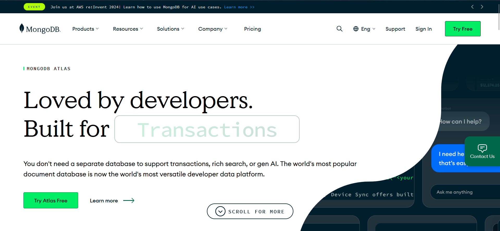

2. Buat akun baru, bisa dengan mengisi form yang ada atau sign-up menggunakan akun google

3. Isi pertanyaan yang diberikan dengan jawaban yang menunjukkan bahwa kalian akan menggunakan `Mongo Atlas` untuk pembelajaran

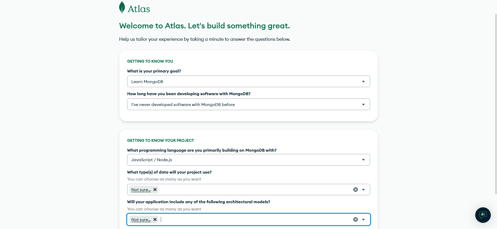

4. Pilih pilihan cluster `M0` untuk mendapatkan cluster gratis

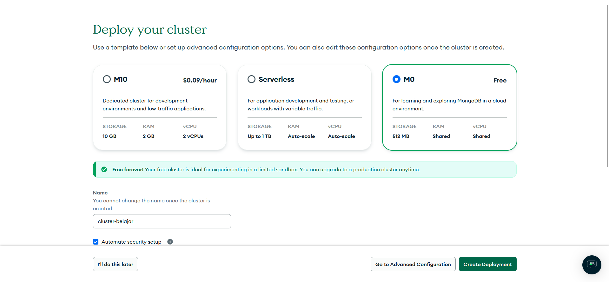

5. Masukkan kredensial bebas. **Penting**: Karena Atlas ini berada di cloud dan dapat diakses oleh siapapun, gunakan password yang kuat untuk mencegah hal - hal yang tidak diinginkan

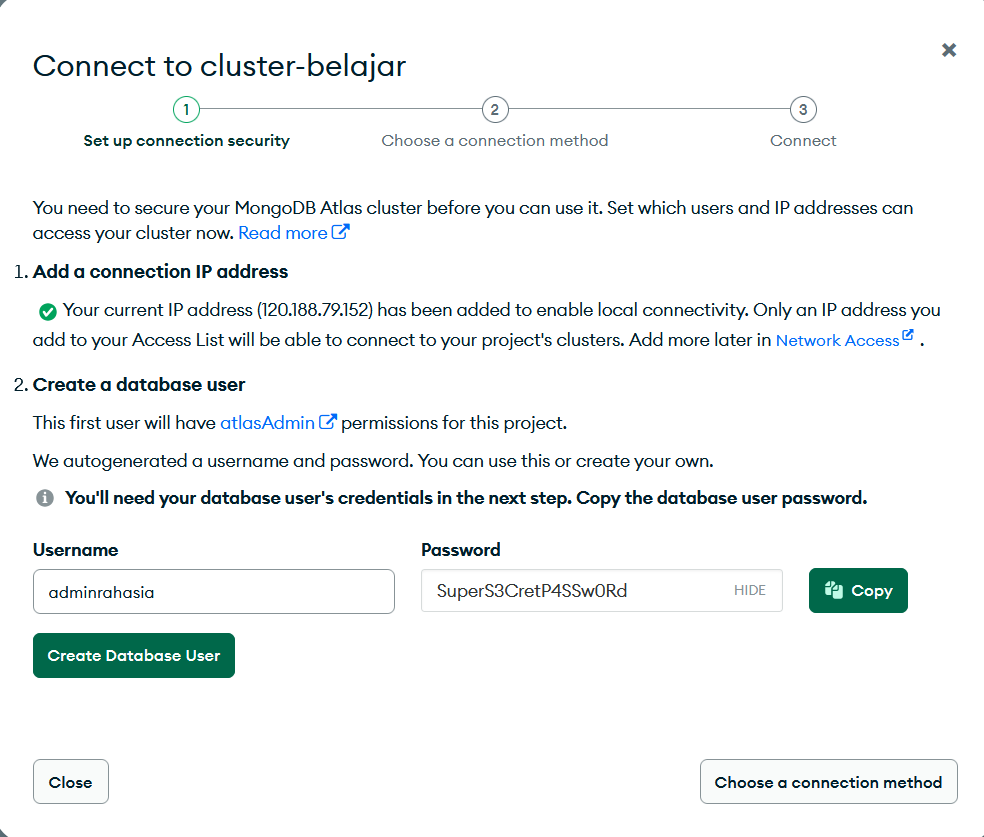

6. Tekan `Create Database User` kemudian `Choose a Connection Method`

7. Pilih pilihan `Drivers`, kemudian salin dan simpan `Connection String` kalian.

### **Cara Mendapatkan Database URI dari `Mongo Atlas`**

Sebelumnya, kalian sudah mendapatkan connection string yang mengarah ke cluster `Mongo Atlas` kalian. Namun, untuk menggunakannya pada proyek Express kita, connection string tersebut perlu diedit agar dapat mengarah langsung ke database MongoDB kita.

1. Pada dashboard Atlas, buat collection baru dengan menekan `Clusters` > `Browse Colelctions` > `Create Database`

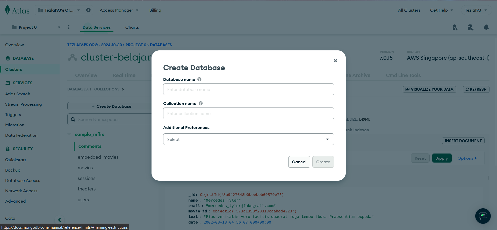

2. `Database Name` merupakan nama database yang akan dibuat, sementara `Collection Name` merupakan nama tabel yang akan dibuat.

3. Ubah connection string kalian dengan menambahkan nama database sebelum simbol query `?`

```
mongodb+srv://adminrahasia:<your_password>@cluster-belajar.rr2ju.mongodb.net/<database_name>?retryWrites=true&w=majority&appName=cluster-belajar
```

## Mongo Client🤖

### Konfigurasi Mongo Client di ExpressJS😶‍🌫️

Untuk membuat sebuah koneksi dari ExpressJS ke MongoDB, harus dibuat sebuah file environment `.env`. Di dalamnya dapat diisi dengan variabel yang berfungsi untuk melakukan define koneksi database maupun port. Berikut contoh file `.env` dengan menggunakan MongoDB Atlas.

```conf
ATLAS_URI=mongodb+srv://<username>:<password>@sandbox.jadwj.mongodb.net/myFirstDatabase?retryWrites=

PORT=5050
```

Untuk melakukan import dari `.env`, buat sebuah file baru `loadEnvironment.mjs` untuk load dari `.env` yang sudah dibuat sebelumnya. Berikut isinya.

```javascript
import dotenv from "dotenv";
dotenv.config();
```

Kemudian di bagian `index.mjs` dapat ditambahkan import dari `loadEnvironment.mjs`.

```javascript
// Load environment variables
import "./loadEnvironment.mjs";
```

Selanjutnya, buat `server/db/conn.mjs` dan ganti kontennya dengan kode berikut. Kode ini akan membuat objek basis data global yang dapat digunakan kembali oleh komponen server lainnya.

```javascript
import { MongoClient } from "mongodb";
const connectionString = process.env.ATLAS_URI || "";
const client = new MongoClient(connectionString);
let conn;
try {
  conn = await client.connect();
} catch (e) {
  console.error(e);
}
let db = conn.db("sample_training");
export default db;
```

Kode ini menggunakan string koneksi yang disediakan dalam file .env dan membuat klien baru. Setelah klien di-define, kode ini akan mencoba membuat koneksi baru ke database. Database kemudian diekspor jika koneksi berhasil. Hal ini memberikan sebuah interface yang seragam yang dapat digunakan kembali di semua modul yang akan dibuat selanjutnya.

### MongoDB Atlas connection string

### 1. Membuat Cluster di MongoDB Atlas

1. **Daftar** atau **Login** ke [MongoDB Atlas](https://www.mongodb.com/cloud/atlas/register).

```javascript
// Di bacaan sebelumnya sudah ada, tapi gaapa kita tambahi juga di sini
```

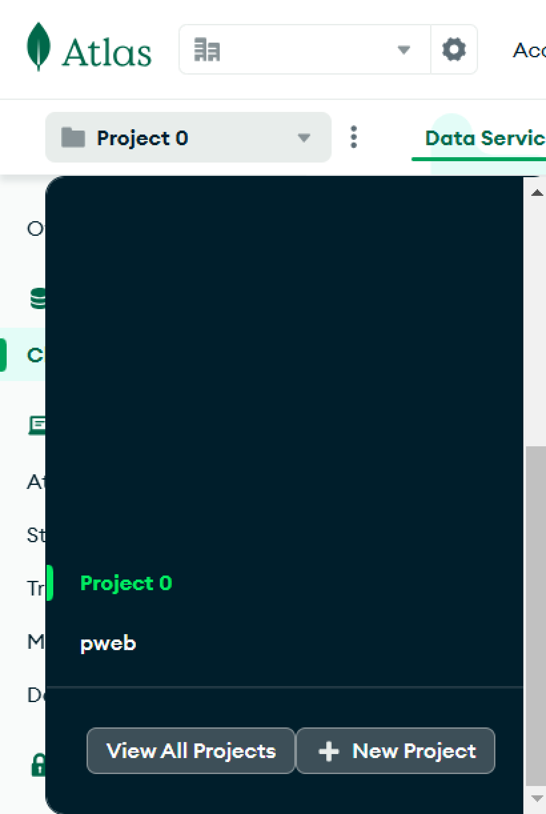

2. **Buat Cluster Baru**:
   - Setelah login, klik **"Create a new projects"**.
   - Klik **Create projects**.

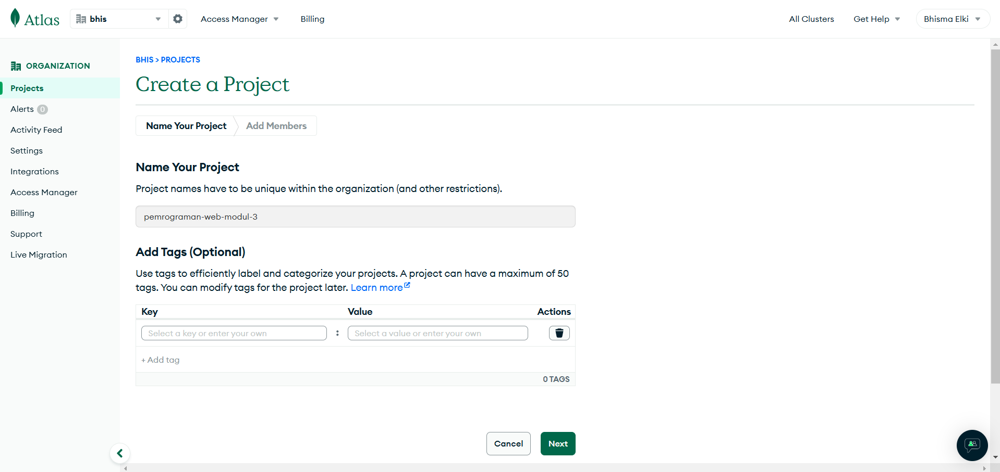

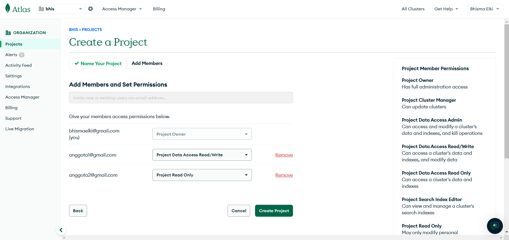

- Setelah itu bisa klik **Create Projects** Pilih **provider** (misalnya AWS, GCP, atau Azure) dan lokasi data center yang diinginkan. Pilih cluster sesuai dengan kebutuhan (Free Tier untuk versi gratis).

### 2. Mendapatkan Connection String

1. Setelah cluster berhasil dibuat, klik **Connect** pada cluster yang baru saja dibuat.

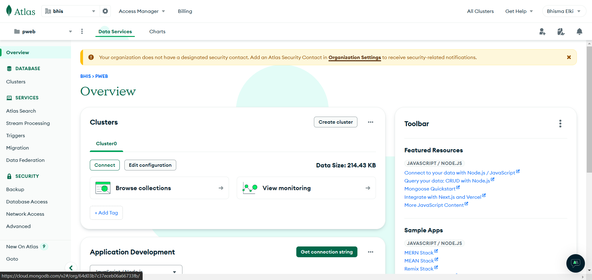

2. Pilih **Connect**.
3. Pada bagian **Connection String**, akan melihat string seperti ini:

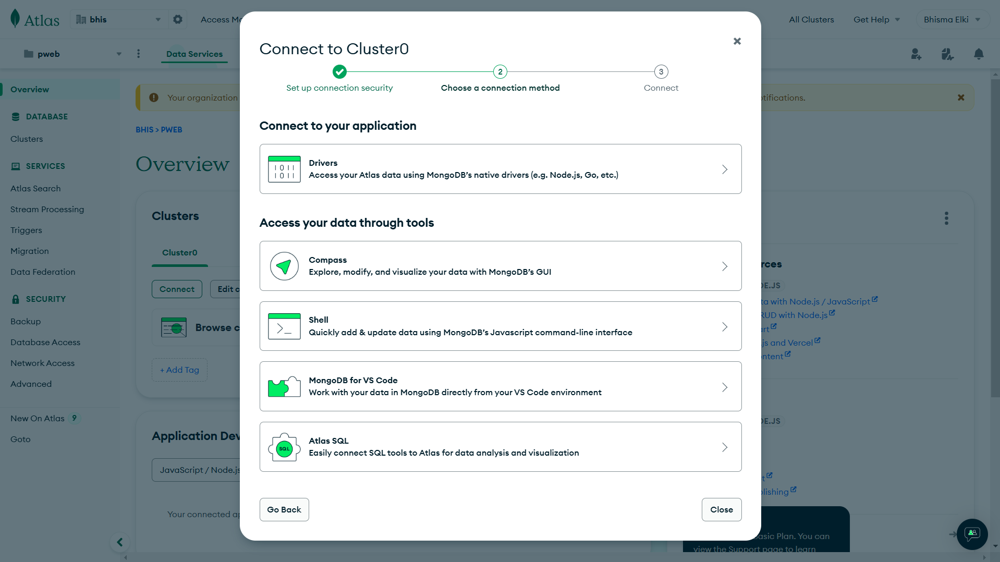

4. klik MongoDB for VS Code (klo ada yang ga pake VS Code bisa pake drivers, based on bacaan sebelumnya)


```plaintext
mongodb+srv://<username>:<password>@cluster0.xxxxxxxxxxx
```

4. **Salin connection string**, lalu ganti `<username>` dan `<password>` dengan username dan password yang dibuat di langkah sebelumnya.
5. **Tempelkan string tersebut** di file `.env` seperti ini:

   ```conf
   MONGODB_URI=mongodb+srv://<username>:<password>@cluster0.xxxxxxxxxxx
   ```

### 3. Menggunakan Connection String di ExpressJS

Ikuti langkah berikut untuk menggunakan connection string di aplikasi ExpressJS:

1. **Instal dotenv dan MongoDB client**, tapi karna client sudah, jadi yang ini pakai mongoose:

   ```bash
   npm install dotenv mongoose
   ```

2. **Buat file `.env`** di root folder aplikasi dengan menambahkan connection string dan port server seperti ini:

   ```conf
   MONGODB_URI=mongodb+srv://<username>:<password>@cluster0.xxxxxxxxxxx
   PORT=8080
   ```

3. **Buat `loadEnvironment.mjs`** atau **`configDB.ts`** untuk mengimpor variabel lingkungan dari `.env`:

   ```javascript
   import dotenv from "dotenv";
   dotenv.config();
   ```

4. **Buat koneksi MongoDB lib mongoose di `server/db/configDb.ts`**:

   ```javascript
   const mongoose = require("mongoose");

   const connectDB = async () => {
     const url = process.env.MONGO_DB_URI || "";
     try {
       await mongoose.connect(url);
       console.log("MongoDB okee");
     } catch (error) {
       console.log("Ngga bisa connect ngab " + error.message);
     }
   };
   module.exports = connectDB;
   ```

5. **Gunakan koneksi di `index.mjs`**:

   ```javascript
   import express from "express";
   import "./loadEnvironment.mjs"; // Load environment variables
   import db from "./server/db/configDb"; // Import MongoDB connection

   connectDB();

   const app = express();
   const port = process.env.PORT || 3000;

   app.get("/", (req, res) => {
     res.send("Welcome to Express + MongoDB Atlas API!");
   });

   app.listen(port, () => {
     console.log(`Server running on http://localhost:${port}`);
   });
   ```

Setelah semua langkah selesai, dapat menjalankan aplikasi dengan menjalankan perintah:

```bash
node index.mjs
```

### Membuat CRUD API dengan ExpressJS dan MongoClient🤠

Dalam contoh ini, akan digunakan contoh yang disediakan dari https://github.com/mongodb-developer/mongodb-express-rest-api-example. Folder structure servernya adalah sebagai berikut.

```
server
    ├── .env
    ├── db
    │   └── conn.mjs
    ├── index.mjs
    ├── loadEnvironment.mjs
    └── routes
        └── posts.mjs
```

- `.env`: File konfigurasi yang menyimpan detail string koneksi MongoDB.
- `db/conn.mjs`: Mengekspos koneksi global ke basis database.
- `index.mjs`: Titik masuk utama untuk server Express.
- `loadEnvironment.mjs`: Memuat variabel environment (.env).
- `routes/posts.mjs`: Mengekspos endpoint REST API dan menjalankan logika bisnisnya.

1. Handling HTTP request
   Pada contoh ini, segala route dari server akan menuju file `server/routes/posts.mjs`. Kemudian semua modul dari request yang data dari enpoint `/posts` akan dilakukan berdasarkan pemenaggilan code berikut pada `index.mjs`.

```javascript
// Load the /posts routes
app.use("/posts", posts);
```

2. Read route
   Fungsi ini mengembalikan daftar 50 artikel pada koleksi posts melalui permintaan **GET** di route `/posts`.

```javascript
// Get 50 posts
router.get("/", async (req, res) => {
  let collection = await db.collection("posts");
  let results = await collection.find({}).limit(50).toArray();
  res.send(results).status(200);
});
```

- Menetapkan collection untuk mengakses koleksi posts.
- Menggunakan `find()` untuk mencari dokumen dan `limit()` untuk membatasi hasil.
- Mengirim hasil ke klien dengan `res.send()` dan menambahkan kode status `200`.

3. Read Route (Advance)
   Fungsi ini mengembalikan tiga artikel terbaru menggunakan pipeline agregasi.

```javascript
// Get new posts
router.get("/latest", async (req, res) => {
  let collection = await db.collection("posts");
  let results = await collection
    .aggregate([
      { $project: { author: 1, title: 1, tags: 1, date: 1 } },
      { $sort: { date: -1 } },
      { $limit: 3 },
    ])
    .toArray();
  res.send(results).status(200);
});
```

Pipeline agregasi digunakan untuk memproyeksikan fields yang diperlukan, mengurutkan berdasarkan tanggal, dan membatasi hasil ke tiga artikel terbaru.

4. Read Single Result
   Mengembalikan artikel berdasarkan parameter `id` dengan menggunakan route dinamis.

```javascript
// Get by id
router.get("/:id", async (req, res) => {
  let collection = await db.collection("posts");
  let query = { _id: ObjectId(req.params.id) };
  let result = await collection.findOne(query);
  if (!result) res.send("Not found").status(404);
  else res.send(result).status(200);
});
```

- Mengambil `id` sebagai parameter dari URL, mengonversinya menjadi `ObjectId`, dan mencari dokumen yang sesuai.
- Jika tidak ditemukan, mengirim status `404`.

5. Create
   Menambahkan artikel baru ke koleksi `posts` melalui metode **POST**.

```javascript
// Create new post
router.post("/", async (req, res) => {
  let collection = await db.collection("posts");
  let newDocument = req.body;
  newDocument.date = new Date();
  let result = await collection.insertOne(newDocument);
  res.send(result).status(204);
});
```

Mengambil body dari request, menambahkan tanggal sebagai timestamp, dan menyimpannya dalam koleksi menggunakan `insertOne()`.

6. Update
   Menambahkan komentar baru pada artikel dengan metode PATCH.

```javascript
// Add new comment
router.patch("/comment/:id", async (req, res) => {
  const query = { _id: ObjectId(req.params.id) };
  const updates = {
    $push: { comments: req.body },
  };
  let collection = await db.collection("posts");
  let result = await collection.updateOne(query, updates);
  res.send(result).status(200);
});
```

`updateOne()` menggunakan operator `$push` untuk menambahkan komentar ke array comments.

7. Delete
   Menghapus artikel dari koleksi `posts`.

```javascript
// Delete post by id
router.delete("/:id", async (req, res) => {
  const query = { _id: ObjectId(req.params.id) };
  const collection = db.collection("posts");
  let result = await collection.deleteOne(query);
  res.send(result).status(200);
});
```

Menggunakan `deleteOne()` dengan `id` untuk menghapus dokumen yang sesuai.

8. Testing API
   Pengujian API dapat dilakukan menggunakan Postman atau perintah curl. Contoh pengambilan artikel terbaru:

```bash
curl localhost:5050/posts/latest
```

Pastikan port sudah sesuai dengan port yang sudah di-define di environment.
<br>

- Berikut link download Postman untuk melakukan testing API (sangat disarankan dan sangat membantu).
  https://www.postman.com/downloads/

- Atau apabila tidak ingin mendownload, gunakan Hoppscotch. https://hoppscotch.io/

- Untuk dokumentasi yang lebih jelas bisa langsung menuju ke website resmi MongoDB berikut.
  https://www.mongodb.com/resources/languages/express-mongodb-rest-api-tutorial
