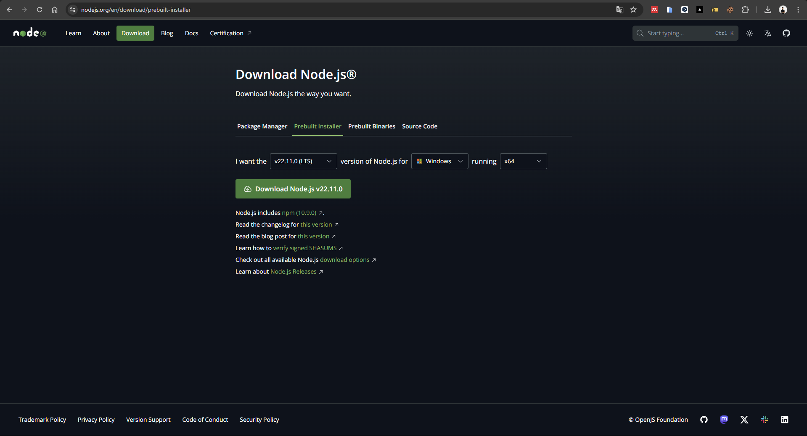
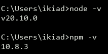
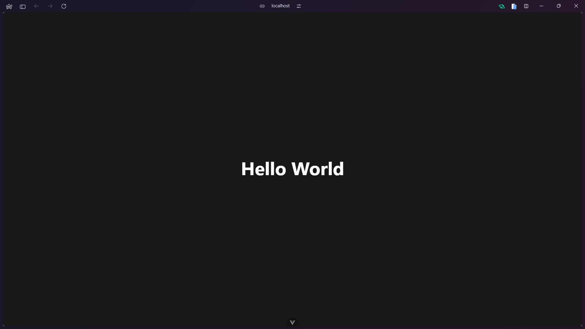

# Modul 4 - Vue JS

## Instalasi

### Instalasi Node

1. Buka website https://nodejs.org/en/download



2. Disarankan untuk download Node versi (LTS)
3. Buka file download, lalu klik Next


4. Klik checkbox agreement, lalu klik Next


5. Pada destination folder biarkan saja secara default dan klik Next


6. Pada custom setup biarkan juga secara default dan klik Next


7. Pada Tools for Native Modules biarkan secara default juga dan klik Next


8. Lalu klik install dan tunggu sampai selesai


9. Buka CMD dan ketik `node -v` atau `npm -v` untuk melakukan verifikasi instalasi



### Instalasi Vue

1. Buka CMD dan run command dibawah ini :

```
npm create vue@latest
```

2. Setelah itu, akan ada banyak pilihan, lalu pilih `No` dengan menekan enter kecuali pada `Vue Router` dan `TypeScript`.

```
✔ Project name: … <your-project-name>
✔ Add TypeScript? … No / Yes
✔ Add JSX Support? … No / Yes
✔ Add Vue Router for Single Page Application development? … No / Yes
✔ Add Pinia for state management? … No / Yes
✔ Add Vitest for Unit testing? … No / Yes
✔ Add an End-to-End Testing Solution? … No / Cypress / Playwright
✔ Add ESLint for code quality? … No / Yes
✔ Add Prettier for code formatting? … No / Yes

Scaffolding project in ./<your-project-name>...
Done.
```

3. Lalu pindah pada folder project, dengan cli :
   ` cd <your-project-name>`
4. Selanjutnya instal node package modules, dengan cli :
   `npm install`
5. Terakhir jalankan vue, dengan cli :
   `npm run dev`

# Introduction

Vue merupakan framework javascript untuk membangun user interfaces yang mencakup sebagian besar fitur umum yang dibutuhkan dalam frontend development.

Ini dibangun diatas HTML, CSS, Javascript standar dan menyediakan model pemrograman deklaratif dan berbasis komponen _(component-based)_ yang dapat membantu kita mengembangkan user interface secara efisien. Vue dirancang agar fleksibel dan dapat diadopsi secara bertahap.

Berikut merupakan 2 fitur inti pada vue :

-   Perenderan Deklaratif
    Vue memungkinkan Anda mendefinisikan tampilan (UI) Anda secara deklaratif menggunakan sintaks template yang mirip dengan HTML. Dengan pendekatan ini, Anda hanya perlu mendeskripsikan bagaimana tampilan harus terlihat berdasarkan status atau data yang diberikan, dan Vue akan mengurus renderingnya secara otomatis saat data berubah.
-   Reaktivitas
    Vue secara otomatis memantau perubahan dalam data dan secara cerdas memperbarui tampilan hanya saat diperlukan. Jadi, kita tidak perlu memanipulasi DOM secara langsung.

## Single File Component

Single-File Component (SFC) merupakan format berkas dalam project vue yang memungkinkan kita untuk menulis komponen vue dalam satu berkas. SFC menggabungkan logika komponen (JavaScript), template (HTML), dan _styling_ (CSS) dalam satu berkas.
Contoh SFC :

```html
<script>
	export default {
		data() {
			return {
				count: 0,
			};
		},
	};
</script>

<template>
	<button @click="count++">Hitung: {{ count }}</button>
</template>

<style scoped>
	button {
		font-weight: bold;
	}
</style>
```

Jadi, SFC adalah cara yang sangat dianjurkan untuk menulis komponen vue. Ini membantu dalam mengorganisasi kode kopmonen dengan rapi dalam satu file.

## API Styles

Komponen Vue dapat ditulis dalam dua gaya API yang berbeda : Options API dan Composition API.

### Options API

Dengan Options API, logika komponen dapat didefinisikan menggunakan _object of options_ seperti `data`, `methods`, dan `mounted`. _Properties_ yang didefinisikan oleh _options_ ditampilkan/diekspos pada `this` di dalam fungsi.

```html
<script>
	export default {
		// Properties returned dari data() menjadi reactive state
		// dan akan ditampilkan dengan `this`.
		data() {
			return {
				count: 0,
			};
		},

		// Methods adalah fungsi yang mengubah status dan trigger updates
		// They can be bound as event handlers in templates.
		methods: {
			increment() {
				this.count++;
			},
		},

		// Lifecycle hooks dipanggil pada tahap yang berbeda
		// dari component's lifecycle.
		// This function will be called when the component is mounted.
		mounted() {
			console.log(`The initial count is ${this.count}.`);
		},
	};
</script>

<template>
	<button @click="increment">Count is: {{ count }}</button>
</template>
```

## Composition API

Compostions API mendefinisikan logika komponen menggunakan fungsi API yang diimpor. Dalam SFC, Composition PI biasanya menggunakan `<script setup>`. Atribut _setup_ adalah petunjuk yang membuat Vue melakukan transformasi waktu kompilasi yang memunngkinkan penggunaan Composition API dengan lebih sedikit _boilerplate_ (kode yang diulang di banyak tempat dengan sedikit atau tanpa variasi).

Contohnya, _imports_ dan fungsi yang dideklarasikan dalam `<script setup>` dapat langsung digunakan di dalam **template**.

```html
<script setup>
	import { ref, onMounted } from "vue";

	// reactive state
	const count = ref(0);

	// Fungsi yang mengubah status dan trigger updates
	function increment() {
		count.value++;
	}

	// lifecycle hooks
	onMounted(() => {
		console.log(`The initial count is ${count.value}.`);
	});
</script>

<template>
	<button @click="increment">Count is: {{ count }}</button>
</template>
```

# Attribute Binding

Untuk membuat ikatan antara antara atribut HTML dan nilai dari Vue App, maka digunakan Vue directive yang disebut `v-bind`.`v-bind` digunakan untuk mengikat atribut secara dinamis ke expression. Penggunaan `v-bind` dalam vue sangatlah umum, sehingga ada cara pintas (_shorthand_) yaitu dengan hanya menggunakan titik dua `:`

Contohnya, atributnya adalah `src` dan ekspressionnya adalah apa pun yang ada dalam tanda kutip atribut tersebut: `"image"`.

```html
<script>
	export default {
		data() {
			return {
				image: "./assets/images/socks_green.jpg",
			};
		},
	};
</script>

```

# Reactivity Fundamentals

## Declaring Reactive State

Dengan _Options API_, kita menggunakan opsi `data()` untuk mendeklarasikan state reaktif dari sebuah komponen. Nilai opsi harus berupa fungsi yang mengembalikan sebuah _object_. Vue akan memanggil fungsi tersebut saat membuat _instance_ komponen baru. Semua properti dari objek ini bisa digunakan pada _lifecycle hook_ dan _method_ dengan `this`. Contoh :

```html
<script>
	export default {
	  data() {
	    return {
	      count: 0
	    }
	  },
	  mounted() {
	    console.log(this.count)
	    this.count += 1  // data juga bisa dimutasi
	  }
</script>
```

Properti _instance_ ini hanya ditambahkan ketika _instance_ pertama kali dibuat, jadi perlu dipastikan bahwa semua properti ada dalam objek yang dikembalikan oleh fungsi `data`. Mungkin juga untuk menambahkan properti baru langsung ke `this` tanpa harus mencantumkannya kedalam `data`, tetapi properti yang ditambahkan dengan cara ini tidak dapat memicu pembaruan reaktif.

## Declaring Methods

Untuk menambahkan metode ke dalam sebuah instance komponen, kita menggunakan opsi `methods`. Ini harus berupa object yang berisi metode-metode yang diinginkan. Vue secara otomatis mengikat nilai `this` untuk metode-metode ini agar selalu merujuk pada instance komponen.

Ini memastikan bahwa metode tersebut tetap memiliki nilai `this` yang benar jika digunakan sebagai _event listener_ atau fungsi _callback_. **Sebaiknya hindari penggunaan _arrow function_ saat mendefinisikan metode, karena itu akan mencegah vue mengikat nilai `this` dengan benar.** Contoh, jika ingin menambahkan metode increment :

```html
<script>
	export default {
	  data() {
	    return {
	      count: 0
	    }
	  },
	  methods: {
	    increment() {
	      this.count++
	    }
	  },
	  mounted() {
	    // Metode dapat dipanggil dalam hook siklus hidup atau metode lainnya
	    this.increment()
	  }
</script>
```

Metode-metode ini dapat diakses dari dalam template komponen. Dalam template, mereka biasanya digunnakan sebagai _event listeners_. Misalnya, dalam tombol `<button>`, kita memanggil metode `increment` saat tombol tersebut diklik :

```html
<template>
	<button @click="increment">{{ count }}</button>
</template>
```

# Class Binding

Dalam Vue, seringkali dibutuhkan untuk mengubah _class_ dan _inline style_. Vue menyediakan fitur khusus saat v-bind digunakan dengan atribut _class_ dan _style_. Selain menggunakan string, ekspresi dalam v-bind juga dapat menghasilkan objek atau array. Hal ini mempermudah pengaturan _class_ dan _style_ elemen HTML secara dinamis.

Contoh penggunaannya yaitu dengan memberikan suatu object ke `:class` (kependekan dari `v-bind:class`) :

```html
<script>
	export default {
		data() {
			return {
				isError: true,
			};
		},
	};
</script>
<div :class="{ text-danger: isError }">Error</div>
```

Class `text-danger` ditentukan oleh nilai boolean dari properti data `isError`. Apabila `isError` bernilai `true`, maka akan merender :

```html
<div class="text-danger">Error</div>
```

# Conditional Rendering

## The v-if directive

Directive `v-if` digunakan untuk menrender berdasarkan suatu kondisi. `v-if` dapat digabungkan dengan kembarannya `v-else` untuk menampilkan elemen lain sebagai _fallback_ jika kondisi pertama ternyata salah.

```html
<button @click="awesome = !awesome">Toggle</button>

<h1 v-if="awesome">Vue is awesome!</h1>
<h1 v-else>Oh no 😢</h1>
```

## Show and Hide

`v-show` digunakan untuk mengubah visibilitas elemen artinya `v-show` akan selalu dirender dan tetap berada di dalam DOM, bukan untuk menambah dan menghapus elemen dari DOM secara keseluruhan, seperti yang dilakukan oleh `v-if`.

```html
<p v-show="isVisible">Visible text</p>
```

`v-show` adalah pilihan yang lebih baik dari segi kinerja jika anda memiliki elemen yang sering berubah visibilitasnya.

# List Rendering

`v-for` digunakan untuk membuat daftar berdasarkan array.

```html
<script>
	export default {
		data() {
			return {
				items: [
					{ id: 1, message: "Foo" },
					{ id: 2, message: "Bar" },
				],
			};
		},
	};
</script>
<template>
	<li v-for="item in items" :key="item.id">{{ item.message}}</li>
</template>
```

Pada `v-for` expression, terdapat list: `item in items`. `items` merujuk pada array `items`, dan `item` adalah array elemen saat ini dari array tesebut, sehingga akan dilakukan looping untuk mencetak `li` array dari seluruh array di `items`.

`:key` digunakan untuk mengikat `id` objek ke atribut `key` sehingga setiap elemen memiliki tanda pengenal unik. setiap objek dari array memiliki `id` dan `message`.

# Event Handling

Dengan menggunakan `v-on`, yang biasanya disingkat menjadi simbol @ untuk listen DOM events dan menjalankan beberapa javascript saat di-trigger. Penggunaannya biasanya `v-on:click="functionName"` atau `@click="functionName"`.

## Inline handlers

Inline JavaScript yang akan dieksekusi saat event di-trigger, biasanya digunakan di case simple, seperti :

```html
<script>
	export default {
		data() {
			return {
				count: 0,
			};
		},
	};
</script>
<template>
	<button @click="count++">Add 1</button>
	<p>Count is: {{ count }}</p>
</template>
```

## Method handlers

Biasanya logika pada suatu event handler panjang atau komplex, sehingga tidak dapat dilakukan dengan inline handler. Itulah mengapa `v-on` juga dapat menerima nama atau jalur metode komponen yang ingin dipanggil. Contoh :

```html
<script>
	export default {
		data() {
			return {
				name: "vue jaya",
			};
		},
		methods: {
			greet() {
				alert(`Hello ${this.name}!`);
			},
		},
	};
</script>
<template>
	<button @click="greet">Greet</button>
</template>
```

# Input Bindings

Input bindings dalam Vue adalah cara untuk membuat data binding dua arah pada elemen form input, textarea, dan select. Cara ini dapat dilakukan dengan menggunakan directive `v-model`.

Directive `v-model` secara otomatis mengikat nilai input ke variabel data Vue dan mengubah nilai variabel data saat input diubah.

Dengan demikian, ketika pengguna memasukkan nilai pada input, nilai variabel data Vue akan berubah secara otomatis dan sebaliknya.

```html
<script>
	export default {
		data() {
			return {
				message: "",
			};
		},
	};
</script>

<template>
	<p>Message is: {{ message }}</p>
	<input v-model="message" placeholder="edit me" />
</template>
```

# Computed Properties

Computed properties adalah properti yang dapat diikat ke template seperti properti data, namun memiliki logika seperti metode. Kita menggunakannya untuk menyusun data dari sumber yang ada.

Manfaat :

-   Computed properties di-cache, Vue hanya akaan mengeksekusi ulang _computed property_ ketika salah satu dependensinya berubah
-   Karena computed property adalah sebuah fungsi, kita dapat menambahkan fungsionalitas kompleks yang tidak dapat kita lakukan hanya dengan interpolasi string.

```html
<template>
	<p>Full Name: {{ fullName }}</p>
	<p>
		<label for="firstName">First Name: </label>
		<input id="firstName" type="text" v-model="firstName" />
	</p>
	<p>
		<label for="lastName">Last Name: </label>
		<input id="lastName" type="text" v-model="lastName" />
	</p>
</template>
<script>
	export default {
		data() {
			return {
				firstName: "",
				lastName: "",
			};
		},
		computed: {
			fullName() {
				return this.firstName + " " + this.lastName;
			},
		},
	};
</script>
```

_Computed property_ secara otomatis melacak ketergantungan reaktifnya. Pada contoh, dapat dilihat jika **fullName** bergantung pada **firstaName** dan **lastName**, sehingga akan memperbaruhi setiap ikatan _(binding)_ yang bergantung pada **fullName** ketika **firstName** dan **lastName** berubah.

# Lifecycle Hooks

Ketika Vue instance diinisiasi pertama kali, pada saat yang sama Vue juga menyediakan beberapa function yang di eksekusi step-by-step mulai dari sebelum dan sesudah observasi data, sebelum dan sesudah template di-render, juga sebelum dan sesudah instance di-mounting ke dalam DOM (Data Object Modeling). Pada saat proses tersebut, Vue juga menjalankan fungsi yang disebut lifecycle hook, yang memberikan kesempatan kepada pengguna untuk menambahkan kode mereka sendiri pada tahap tertentu.

## Registering Lifecycle Hooks

Sebagai contoh, `onMounted` dapat digunakan untuk menjalankan kode setekah komponen telah menyelesaikan rendering awal dan membuat node DOM :

```html
<script setup>
	import { onMounted } from "vue";

	onMounted(() => {
		console.log(`the component is now mounted.`);
	});
</script>
```

Terdapat hook lain yang dapat dipanggil di berbagai tahap _instance's lifecycle_ , yang paling digunakan adalah `onMounted`, `onUpdated`, dan `Unmounted`.

## Lifecycle Diagram

Di bawah ini adalah diagaram _instance lifecycle_ .


# Refs

Ketika menggunakan vue untuk merender tampilan secara deklaratif, mungkin diperlukan untuk mengakses elemen DOM secara langsung dalam beberapa kasus. Untuk ini, kita dapat menggunakan atribut khsusus bernama `ref`.

`ref` adalah atribut khusus, ini memungkinkan kita untuk mendapatkan referensi langsung ke elemen DOM tertentu atau instance komponen turunan setelah elemen tersebut di-_mounted_. Berikut contoh ref :

```html
<input ref="input" />
```

`ref` dapat diakses melalui `this.$refs`. Dapat diingat kalau ref hanya dapat diakses setelah komponen di-_mounted_.

## `v-for` refs

Ketika `ref` digunakan didalam `v-for`, nilai ref yang dihasilkan akan berupa array yang berisi elemen terkait. Contoh :

```html
<script>
	export default {
		data() {
			return {
				list: [1, 2, 3],
			};
		},
	};
</script>
<template>
	<ul>
		<li v-for="item in list" ref="items">{{ item }}</li>
	</ul>
</template>
```

# Tailwind CSS

## Introduction

Tailwind CSS adalah sebuah framework CSS untuk mempermudah styling dan layouting website. Dengan Tailwind, styling dapat dilakukan dengan class-class atau kode tertentu untuk mengatur tampilan website mulai dari warna, ukuran, margin, padding, dan lainnya tanpa perlu melakukan defining CSS _from scratch_. Sehingga, untuk melakukan styling hanya perlu menambahkan kelas-kelas pada HTML sesuai kebutuhan.


## Instalasi Tailwind CSS pada Vue

Setelah melakukan init project Vue, perlu dilakukan langkah-langkah berikut untuk integrasi Tailwind CSS pada project Vue yang telah di-init.

1. Melakukan instalasi tailwindcss dan dependecies-nya.

```bash
npm install -D tailwindcss postcss autoprefixer
```

2. Generate file `tailwind.config.js` sebagai file konfigurasi Tailwind CSS dan file `postcss.config.json`.

```bash
npx tailwindcss init -p
```

3. Tambahkan konfigurasi path template file pada `tailwind.config.js` untuk mengaktifkan Tailwind CSS di setiap file yang di-render.

```javascript
/** @type {import('tailwindcss').Config} */
export default {
	// Konfigurasi yang perlu ditambahkan:
	content: ["./index.html", "./src/**/*.{vue,js,ts,jsx,tsx}"],
	// notes: sesuaikan file path dengan kebutuhan kalian dan pastikan file path-nya benar
	theme: {
		extend: {},
	},
	plugins: [],
};
```

4. Tambahkan `@tailwind` directives pada file CSS pada project Vue. Bisa dilakukan di `base.css` atau `main.css` jika file tersebut yang di-import di template `views`, atau bisa menambahkan file CSS yang terpisah dan pastikan import file yang benar pada template `views`.

```css
@tailwind base;
@tailwind components;
@tailwind utilities;
```

5. Start project Vue

```bash
npm run dev
```

## Contoh penggunaan Tailwind CSS pada Vue

```html
<template>
	<main>
		<p class="text-white text-5xl font-bold text-center py-96">Hello World</p>
	</main>
</template>
```



## Dokumentasi Tailwind CSS

Untuk mempelajari dan menggunakan Tailwind CSS, bisa menuju ke link documentation resmi dari Tailwind CSS berikut karena documentation yang diberikan sudah sangat lengkap dan mencakup hampir keseluruhan penggunaan Tailwind CSS.

**[Dokumentasi Tailwind CSS](https://tailwindcss.com/docs/installation)**
